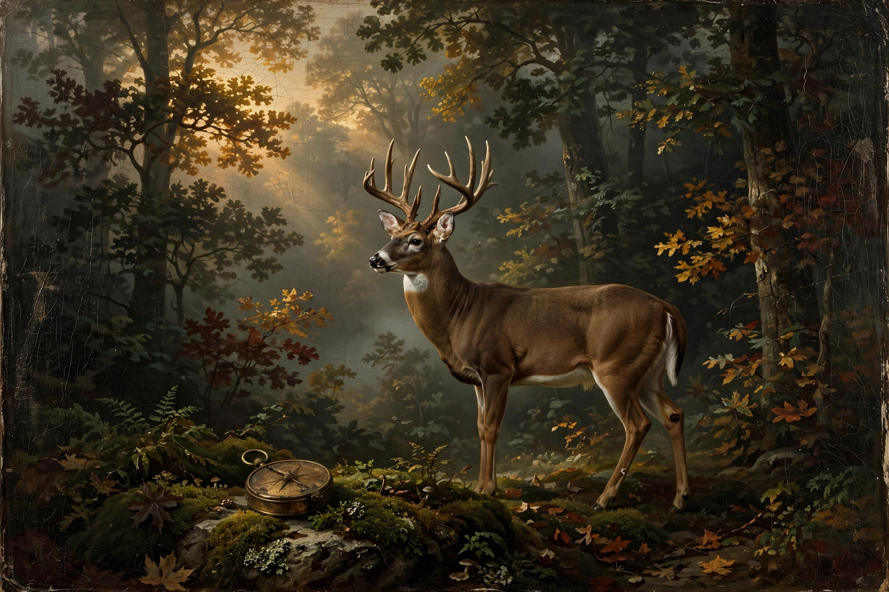

# BullHunt — PA Game Lands hunting app



An offline-first hunting companion for Pennsylvania State Game Lands, built as a
progressive web app (PWA) wrapped with Capacitor for the iOS App Store.

**Project:** `~/workspace/hunting-app/` · Web app: `www/` · iOS project: `ios/`
App name: **BullHunt** · Bundle ID: `com.thebullbrew.bullhunt`

## Features

- **Offline SGL map** — real PA Game Commission State Game Land boundaries
  (309 polygons, Jan 2023 via PASDA), bundled in the app. Tap any game land for
  its SGL number, acreage, and region. Satellite base map.
- **Offline tile packs** — download satellite imagery for a 5/10/20-mile radius
  around your GPS location or the map center. Cached on-device; the map works
  with zero signal.
- **Parking areas** — 2,735 PGC parking points, toggleable.
- **WMU overlay** — Wildlife Management Unit boundaries, toggleable.
- **Compass** — big dial, true heading (iOS motion permission), lat/lon,
  altitude, GPS accuracy. Fully offline.
- **Weather** — current temp, wind speed/direction/gusts, precipitation plus a
  24-hour strip (Open-Meteo, free/no key). Last reading cached for offline use.
  Wind readout includes scent direction ("wind from X — scent blows Y").
- **Hunt tab** — sunrise/sunset computed on-device (NOAA algorithm), legal
  shooting hours (≈ ½ hr before sunrise to ½ hr after sunset), moon phase +
  illumination, and a plain-English verdict combining light + moon.
- **Waypoints** — drop pins at your location or the map center (stand, parking,
  trail camera, blood trail, other), bearing + distance from you, one-tap
  "Go" navigation on the map, GPX export.

## Data sources & caveats

- SGL boundaries / parking / WMUs: PA Game Commission via PASDA (Jan 2023).
  For reference only — verify boundaries and current regulations with the PGC.
- Satellite tiles: Esri World Imagery (Esri, Maxar, Earthstar Geographics).
  Bulk tile downloading is subject to Esri's terms; for a production release,
  consider a paid tile provider (e.g. MapTiler) or confirm Esri's app terms.
- Shooting hours are approximate. Always confirm with the current PGC
  Hunting & Trapping Digest — rules vary by species/season.

## Run it now (PWA)

```bash
cd ~/workspace/hunting-app/www
python3 -m http.server 8000
# open http://localhost:8000 — or serve over LAN and "Add to Home Screen" on iPhone
```

## Ship it to the App Store (needs a Mac)

Everything is built; only the signed build + upload needs macOS:

1. **Apple Developer account** — enroll at developer.apple.com ($99/yr).
2. Copy this project to the Mac. Open `ios/App/App.xcworkspace` in Xcode.
3. In Xcode: select the App target → Signing & Capabilities → set your Team.
   (Bundle ID `com.thebullbrew.bullhunt` is already set; rename in
   `capacitor.config.ts` + Xcode if you want a different one.)
4. Bump version in Xcode (Marketing Version / Build).
5. **Product → Archive**, then **Distribute App → App Store Connect** → upload.
6. In App Store Connect: create the app record, add screenshots (6.7" and 6.5"
   required), description, keywords, support URL, and a **privacy policy URL**
   (required — the app uses location; disclose it in the policy and in
   App Privacy "nutrition labels": Location + Diagnostics).
7. Submit for review. Hunting/outdoor apps are standard; typical review is 1–3 days.

After changing web code, re-run `npx cap sync ios` from the project root before
archiving.

## Files

```
www/                 PWA (this is the whole app)
  index.html         app shell + 5 tabs
  css/app.css        dark-heritage theme
  js/                util, store, map, offline, compass, weather, hunt, waypoints, app
  js/vendor/         maplibre-gl (bundled, works offline)
  data/              sgl.min.geojson, sgl_parking.min.geojson, wmu.min.geojson
  icons/             PWA icons
  sw.js              service worker (offline shell + tile cache)
  manifest.webmanifest
ios/                 Capacitor iOS project (App.xcworkspace — open in Xcode)
data/                raw downloads + get_sgl.py / simplify.py (re-fetch tooling)
capacitor.config.ts
```

## Refreshing the game-lands data

```bash
cd ~/workspace/hunting-app/data
python3 get_sgl.py      # re-download from PASDA
python3 simplify.py     # simplify + copy into www/data/
cd .. && npx cap sync ios
```
